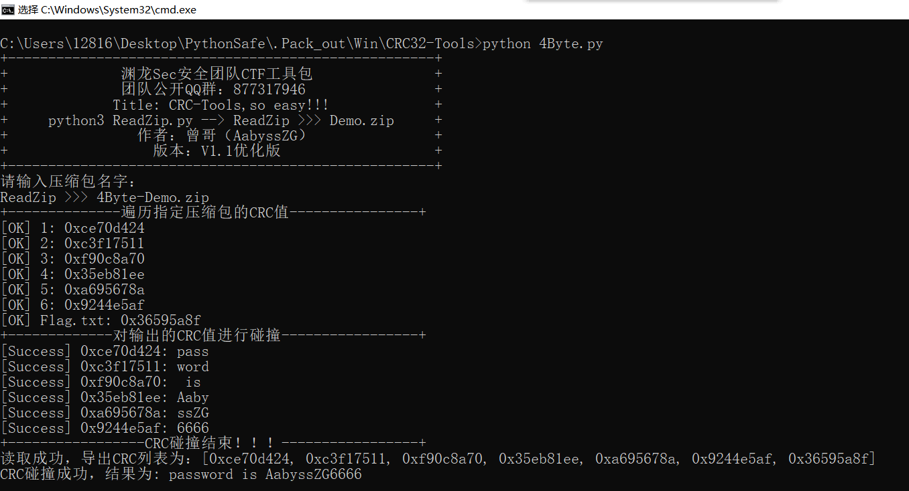

# CRC32-Tools
## 1#关于该项目
在我们日常的CTF比赛中，通常会遇到压缩包破解的问题。其中重要的一个操作就是通过CRC碰撞来获取压缩包内小文件的内容，从而尝试解密压缩包
而我在实际的CTF比赛中，发现常用的CRC的爆破脚本并不好用（主要是还需要一些人工操作，如果压缩包内的文件较多，非常麻烦），就萌生了自己写一个自动化CRC碰撞脚本出来的想法

本项目的特点：
- 适配性高，能方便运行于Python3环境
- 操作简单，适合CTFer上手，可自动化通过CRC碰撞获取内容
- 傻瓜式操作，只需要输入同目录下的压缩包文件名即可

## 2#使用方式
在大部分的CTF比赛中，考题一般都会考察内容为1Byte/2Byte/3Byte/4Byte的CRC碰撞，所以目前我就写了这四个版本，如果后面有需求，我会优化或者写其他的版本

本项目主要由5个Python脚本构成（需要Python3环境运行脚本）：
- ReadZip.py：自动读取压缩包内各个文件的CRC值并导出（下面几个脚本均内置了该功能，只是拿出来方便看罢了）
- 1Byte-CRC.py：自动读取目标压缩包文件，并自动进行1Byte的CRC碰撞并输出文件内容
- 2Byte-CRC.py：自动读取目标压缩包文件，并自动进行2Byte的CRC碰撞并输出文件内容
- 3Byte-CRC.py：自动读取目标压缩包文件，并自动进行3Byte的CRC碰撞并输出文件内容
- 4Byte-CRC.py：自动读取目标压缩包文件，并自动进行4Byte的CRC碰撞并输出文件内容

使用截图如下：

## 3#注明
- 本项目仅用作CTF学习交流，本人一概不负任何责任
- 这是我参加某次比赛时候，遇到CRC碰撞题目临时做的脚本，本身并没有做多线程或者优化，碰撞速度并不是很快（后面版本考虑优化速度）
- 本人CTF实力挺菜的（真的），所以别找我帮你们看题目，哈哈
